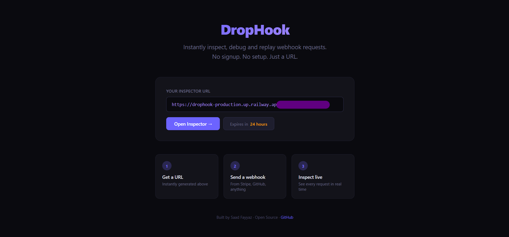
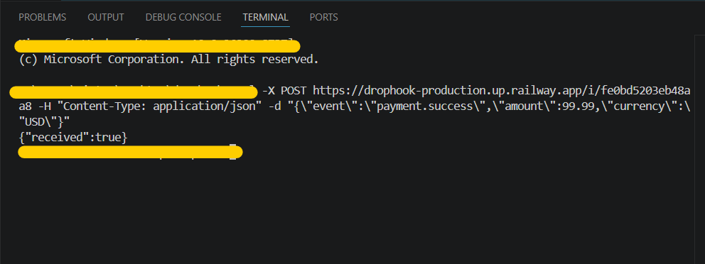
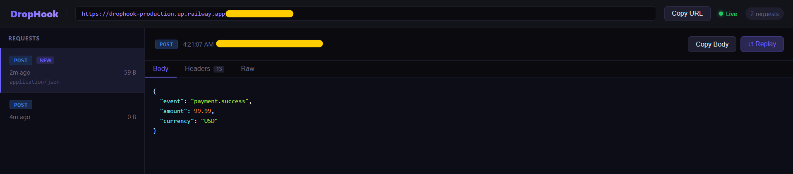

# DropHook — Webhook Inspector & Debugger

> Instantly inspect, debug, and replay webhook requests. Get a live URL in seconds. No signup. No setup. Just a URL.

**Live Demo → [drophook.vercel.app](https://drophook-alpha.vercel.app/)**

    







---

---

## What is DropHook?

Every serious web service communicates through webhooks. When you pay on Stripe, Stripe fires a POST request to your server saying "payment succeeded." When someone pushes code to GitHub, GitHub fires a POST to your CI/CD pipeline. When Twilio receives a call, it fires a POST to your app.

**The problem:** You can't see these requests easily. When an integration breaks, you have no idea what was actually sent. Was it the headers? Was the body malformed? Did it even arrive? Normally you'd need a running server, server logs, and a tunneling tool like ngrok — just to peek at a single payload.

**DropHook fixes this.** Open the app, get a URL instantly, paste it anywhere that fires HTTP requests, and watch every request appear on your screen in real time — method, headers, body, timestamp, IP address. No account required.

---

## The Problem It Solves

| Problem | Without DropHook | With DropHook |
|---|---|---|
| Debugging a failing Stripe webhook | Guess from logs, redeploy, wait | See the exact payload Stripe sent in seconds |
| Building a frontend before the backend exists | Guess the data structure | Capture a real request and build against actual data |
| Proving an integration works to a client | Set up staging server, write docs | Share a live URL — they see requests arrive in real time |
| Testing edge case webhook payloads | Manually construct test data | Replay any real request captured previously |

---

## Features

- **Instant inspector URL** — generated on page load, no signup needed
- **Real-time request streaming** — new requests appear via WebSocket instantly
- **Full request inspection** — method, headers, body, content-type, source IP, timestamp
- **JSON syntax highlighting** — auto-formatted body viewer with colour coding
- **Request replay** — re-fire any captured request to a target URL of your choice
- **Body + Headers + Raw tabs** — three views of every request
- **24-hour session expiry** — automatic cleanup, no stale data
- **Share your session** — give the URL to a teammate, both see the same live stream
- **Copy URL** — one click to copy your inspector URL
- **Rate limiting** — 100 requests per session per hour, DDoS protection built in

---

## How It Works

```
Webhook Sender (Stripe / GitHub / Twilio / anything)
        │
        │  POST https://drophook-production.up.railway.app/i/abc123
        ▼
┌─────────────────────────────────────┐
│         Express.js Backend          │
│  • Validate session exists          │
│  • Sanitize + store request to DB   │
│  • Broadcast via WebSocket          │
└──────────────┬──────────────────────┘
               │
       ┌───────┴────────┐
       ▼                ▼
  PostgreSQL DB    WebSocket Hub
  (Supabase)       (ws library)
                        │
                        ▼
              Next.js Dashboard
              (live request stream)
```

1. User visits the app → a session is created instantly in PostgreSQL
2. User copies their unique inspector URL (e.g. `/i/abc123`)
3. User pastes it into Stripe, GitHub, or any service as a webhook URL
4. That service fires a POST request to the URL
5. Express receives it, stores it in PostgreSQL, and emits it via WebSocket
6. The Next.js dashboard receives the WebSocket event and renders it instantly
7. Session expires after 24 hours — all data is automatically cleaned up

---

## Tech Stack

| Layer | Technology | Why |
|---|---|---|
| **Frontend** | Next.js 14 (App Router) | SSR landing page, dynamic inspector route, SEO |
| **Backend** | Node.js + Express.js | REST API, WebSocket server, webhook receiver |
| **Database** | PostgreSQL (Supabase) | Relational data — sessions → requests (1-to-many) |
| **Realtime** | WebSockets (ws library) | Sub-10ms request streaming to dashboard |
| **Styling** | Tailwind CSS | Rapid, consistent UI development |
| **Deploy (FE)** | Vercel | Native Next.js platform, zero config |
| **Deploy (BE)** | Railway | Persistent Node process for WebSocket support |

---

## Architecture Decisions

**Why raw WebSockets instead of Supabase Realtime?**
Raw WebSockets via the `ws` library demonstrate deeper protocol knowledge. The implementation handles session rooms, client reconnection, and expiry broadcasts manually — all things abstracted away by higher-level libraries.

**Why raw SQL instead of an ORM like Prisma?**
The goal is to demonstrate real SQL knowledge — parameterised `INSERT`, `SELECT`, `INDEX`, and `CASCADE DELETE` queries written directly with the `pg` library. An ORM would hide this entirely.

**Why Express on Railway instead of Next.js API routes?**
WebSocket connections require a persistent Node.js process. Vercel's serverless functions are stateless and terminate after each request — they cannot hold an open WebSocket connection. Railway runs a real server continuously.

**Why PostgreSQL instead of MongoDB?**
The data is naturally relational — one session has many requests. Using `JSONB` for headers gives the semi-structured flexibility of NoSQL within a relational system, without sacrificing foreign key constraints or cascade deletes.

---

## Database Schema

```sql
CREATE TABLE sessions (
  id            VARCHAR(16)  PRIMARY KEY,
  created_at    TIMESTAMPTZ  NOT NULL DEFAULT NOW(),
  expires_at    TIMESTAMPTZ  NOT NULL,
  request_count INT          NOT NULL DEFAULT 0
);

CREATE TABLE requests (
  id           UUID         PRIMARY KEY DEFAULT gen_random_uuid(),
  session_id   VARCHAR(16)  NOT NULL REFERENCES sessions(id) ON DELETE CASCADE,
  received_at  TIMESTAMPTZ  NOT NULL DEFAULT NOW(),
  method       VARCHAR(10)  NOT NULL,
  headers      JSONB        NOT NULL DEFAULT '{}',
  body         TEXT,
  body_size    INT          NOT NULL DEFAULT 0,
  source_ip    VARCHAR(45),
  content_type VARCHAR(255)
);
```

---

## API Reference

| Method | Endpoint | Description |
|---|---|---|
| `POST` | `/api/sessions` | Create a new inspector session |
| `GET` | `/api/sessions/:id` | Get session info and status |
| `POST` | `/i/:id` | **Webhook receiver** — accepts any HTTP request |
| `GET` | `/api/requests/:sessionId` | Fetch all captured requests |
| `GET` | `/api/requests/:sessionId/:requestId` | Fetch a single request in full detail |
| `POST` | `/api/requests/:sessionId/:requestId/replay` | Replay a request to a target URL |
| `DELETE` | `/api/sessions/:id` | Delete session and all its requests |

### WebSocket Protocol

```json
// Client → Server (subscribe to session)
{ "type": "subscribe", "sessionId": "abc123" }

// Server → Client (new request arrived)
{ "type": "new_request", "data": { "id": "...", "method": "POST", "received_at": "...", "body_size": 342 } }

// Server → Client (session expired)
{ "type": "session_expired" }
```

---

## Running Locally

### Prerequisites
- Node.js 18+
- A [Supabase](https://supabase.com) project (free tier)

### 1. Clone the repo
```bash
git clone https://github.com/SF-6655/drophook.git
cd drophook
```

### 2. Set up the database
Run `backend/migrations/001_initial.sql` in your Supabase SQL editor.

### 3. Configure the backend
```bash
cd backend
cp .env.example .env
# Fill in your DATABASE_URL from Supabase
npm install
node src/index.js
```

### 4. Configure the frontend
```bash
cd frontend
cp .env.local.example .env.local
# Set NEXT_PUBLIC_API_URL=http://localhost:3001
# Set NEXT_PUBLIC_WS_URL=ws://localhost:3001
npm install
npm run dev
```

### 5. Open the app
Visit `http://localhost:3000` — you'll see a generated inspector URL immediately.

### 6. Test it
```bash
curl -X POST http://localhost:3001/i/YOUR_SESSION_ID \
  -H "Content-Type: application/json" \
  -d '{"event":"payment.success","amount":99.99}'
```

The request will appear in your dashboard instantly.

---

## Security

| Threat | Mitigation |
|---|---|
| Spam / DDoS | Rate limiting — 100 requests per session per hour via `express-rate-limit` |
| XSS via body content | Body stored as raw text, React escapes output by default |
| Session ID guessing | `crypto.randomBytes(8)` — 64-bit entropy, 2^64 combinations |
| SQL injection | Parameterised queries only — never string concatenation |
| Sensitive header exposure | `sanitize.js` strips `Authorization`, `cookie`, and proxy headers |
| Stale data accumulation | `delete_expired_sessions()` PostgreSQL function cleans up automatically |

---

## Project Structure

```
drophook/
├── backend/
│   ├── src/
│   │   ├── index.js           # Express + WebSocket server entry point
│   │   ├── db.js              # PostgreSQL connection pool
│   │   ├── routes/
│   │   │   ├── sessions.js    # Session CRUD endpoints
│   │   │   ├── inspect.js     # Webhook receiver — core endpoint
│   │   │   └── requests.js    # Request history + replay
│   │   ├── websocket/
│   │   │   └── hub.js         # Session rooms + broadcast logic
│   │   ├── middleware/
│   │   │   └── rateLimit.js   # IP-based rate limiting
│   │   └── utils/
│   │       ├── generateId.js  # Cryptographic session ID generation
│   │       └── sanitize.js    # Header sanitization
│   └── migrations/
│       └── 001_initial.sql    # Full database schema
│
└── frontend/
    ├── app/
    │   ├── page.jsx           # Landing page (SSR)
    │   ├── i/[id]/page.jsx    # Inspector dashboard (client)
    │   └── expired/page.jsx   # Expired session page
    ├── components/
    │   ├── RequestList.jsx    # Left panel — request list
    │   ├── RequestDetail.jsx  # Right panel — body, headers, raw
    │   ├── StatusBadge.jsx    # HTTP method colour badges
    │   ├── CopyButton.jsx     # One-click copy
    │   └── WSStatus.jsx       # WebSocket connection indicator
    ├── hooks/
    │   └── useWebSocket.js    # WS connection + auto-reconnect
    └── lib/
        └── api.js             # Fetch wrapper for Express API
```

---

## Built By

**Saad Fayyaz** — Full Stack Developer & Founder

- GitHub: [@SF-6655](https://github.com/SF-6655)
- Built as part of a developer tools portfolio — designed from a real pain point, not a tutorial

---

*DropHook is free and open source. If you find it useful, star the repo.*